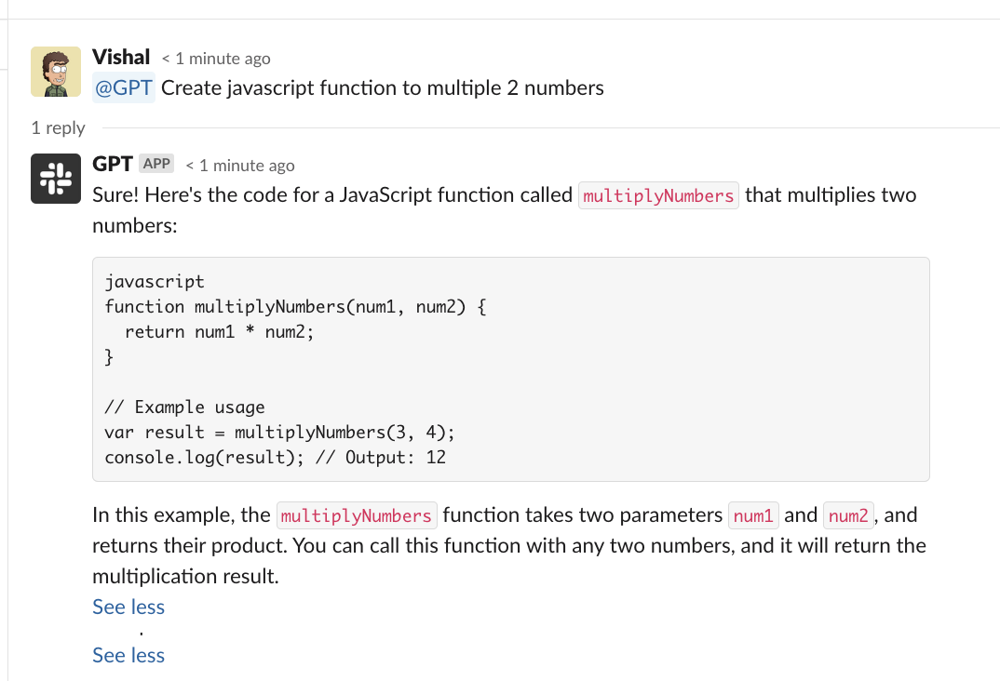

# Slack GPT
Integrate Open AI Chat GPT with Slackbot. The replies are provided in a thread and it supports context by pulling all messages from a thread. 

It also has ability to block messages if they match any blocked keywords (company specific info) or regex patters (JWT and API keys for example)

You will need a slack app with App and Bot token along with API Key from Open AI





### Run
```bash
# Rename env.sample.sh to env.sh
. ./env.sh
go mod tidy
go run cmd/app/app.go 
```

### Run in Docker
```
docker build -t gpt .
docker run -it -e GPT_API_KEY=${GPT_API_KEY} -e SLACK_APP_TOKEN=${SLACK_APP_TOKEN} -e SLACK_BOT_TOKEN=${SLACK_BOT_TOKEN} gpt 
```